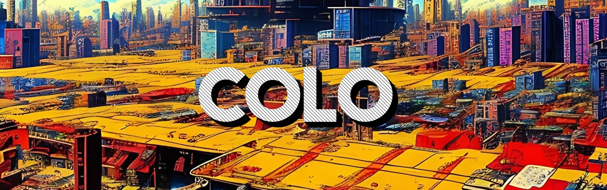

I always feel hard to define myself in particular from the professional point of view. From the last years I always work in crypto project, one of them is operative in the Polygon mainnet. I program in Solidity and I'm interesting in Web3 oriented system such as Blockchain, IPFS and smart contract.

I think the Internet right now needs, both technically and ethically, to migrate to a decentralized paradigm. It will benefit both the internet understood as networks of networks and the internet understood as a medium in which humans socialize, do business and build their lives.

`Time will give us the details; for now I focus on the ideas.`

In my spare time I train a lot and try to improve myself in all aspects. 

# My GitHub Stats

Those are just the statistics of my github public profile:

And my Languages are:

